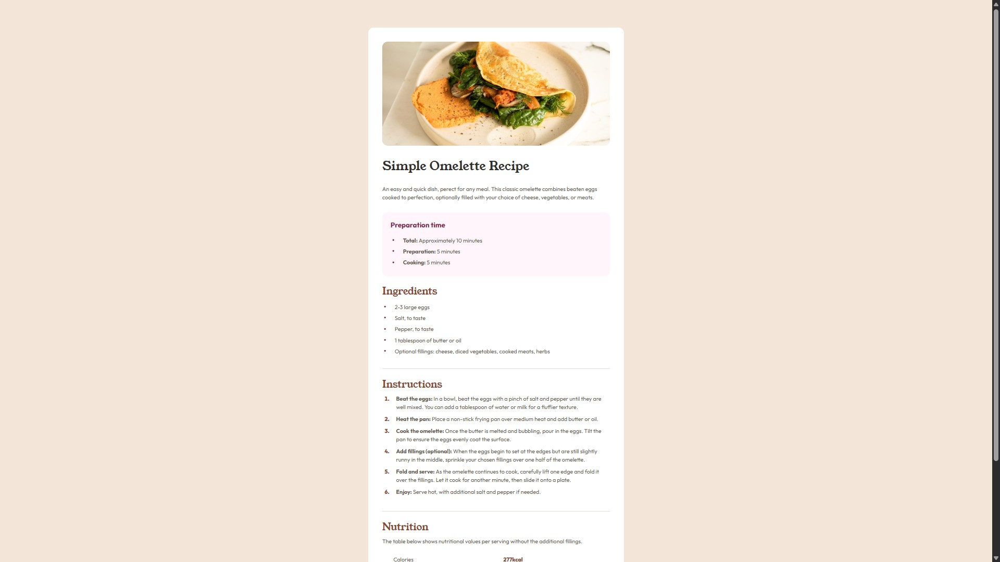

# Frontend Mentor - Recipe page

This is a solution to the [Recipe page challenge on Frontend Mentor](https://www.frontendmentor.io/challenges/recipe-page-KiTsR8QQKm). Frontend Mentor challenges help you improve your coding skills by building realistic projects.

## Table of contents

- [Overview](#overview)
  - [The challenge](#the-challenge)
  - [Screenshot](#screenshot)
  - [Links](#links)
- [My process](#my-process)
  - [Built with](#built-with)
  - [What I learned](#what-i-learned)
  - [Continued development](#continued-development)
  - [Useful resources](#useful-resources)
  - [Experience](#experience)
- [Author](#author)
- [Acknowledgments](#acknowledgments)

## Overview

### The challenge

Your challenge is to build out the recipe page and get it looking as close to the design as possible.
You can use any tools you like to help you complete the challenge. So if you've got something you'd like to practice, feel free to give it a go.

### Screenshot




### Links

- Live Site URL: [cgmatrix.github.io/frontendmentor.io_recipe_page/](https://cgmatrix.github.io/frontendmentor.io_recipe_page/)

## My process

### Built with:

- Semantic HTML5
- CSS custom properties
- Flexbox
- Mobile-first workflow

### What I learned:

This exercise helped me inprove my skills by making use of:
- Symantic Html
- CSS flexbox
- CSS pseudo classes - :nth-child(), ::before
- Media queries - @media
 
This code practise also helped me to build further skills for building a responsive web page by starting with mobile first, instead of desktop.

Example of code snippest from project after research on MDN & studying othe website through Google's DevTools:
```html
<ul class="center_list">
 <li>2-3 large eggs</li>
 <li>Salt, to taste</li>
 <li>Pepper, to taste</li>
 <li>1 tablespoon of butter or oil</li>
 <li>Optional fillings: cheese, diced vegetables, cooked meats, herbs</li>
</ul>
```

```css
.center_list li::before {
  content: "•";
  font-size: 1.5rem;
  padding-right: 1.5rem;
  padding-left: 0.25rem;
  line-height: 2rem;
  color: hsl(332, 51%, 32%);

  display: inline-flex;
  align-items: center;
  height: 2rem;
}
```

### Continued development:

Based on extending skills for future projects, I'm planning to focus more on the following:
- CSS Animate - For animated labels that guide the user.
- CSS Tailwind - To speed up UI development.

### Useful resources:

- [MDN Web Docs](https://developer.mozilla.org/en-US/) - This always helped me to regain knowledge of stuff I've forgotten.
- [CSS Tricks](https://css-tricks.com/) - This is an amazing webiste that contains powerfull spreadsheets. 

### Experience:

When building responsive websites, I always first optimise the raw code of the layout I've started with (desktop or mobile) as much as possible before starting with media queries to setup the next layout for a different screen size.

## Author

- Github - [CgMatrix](https://github.com/CgMatrix)
- Frontend Mentor - [@CgMatrix](https://www.frontendmentor.io/profile/CgMatrix)

## Acknowledgments

Big thanks to Frontend Mentor for providing the challenge & design with resources to improve & develop more skills.
